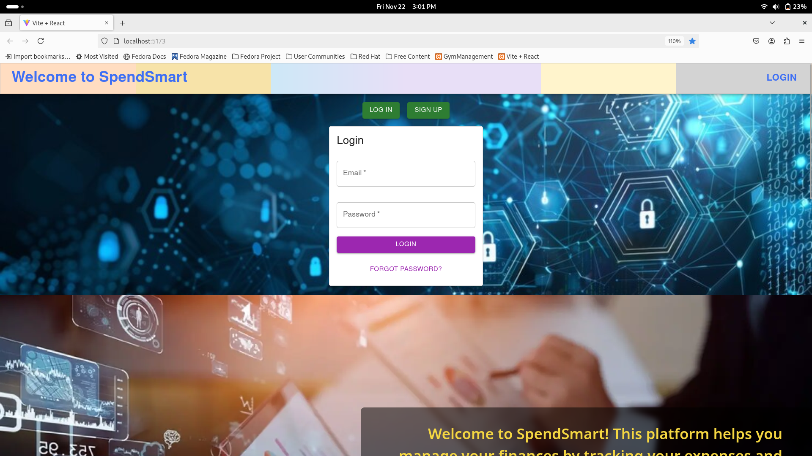

---

# SpendSmart

SpendSmart is a simple yet effective expense tracker application designed to help users manage their income and expenses efficiently. This project is developed as a mini-project for a college internship review, with plans for future enhancements and deployment.

---

## Features

- **User Profile**: Displays user details, including name, profile picture, email, and account balance.
- **Income and Expense Tracking**: Add, filter, and view recent income and expense transactions.
- **Dashboard**: Provides an overview of income and expenses in a full-page format.
- **Sidebar Navigation**: Easy access to sections like Profile, Dashboard, Income, Expenses, Logout, and Categories.
- **Future-Ready Design**: Basic settings and reports features planned for future implementation.

---

## Project Structure

The repository is divided into the following sections:

- **Frontend**: Developed using React.js for a dynamic and user-friendly interface.
- **Backend**: Powered by Flask-SQLAlchemy with MySQL for database integration.
- **Virtual Environment**: Located in `~/Documents/Projects/spendsmart/expense_tracker_backend/venv`.

---

## Getting Started

### Prerequisites

Ensure you have the following installed on your system:

- **Node.js** (with npm)
- **Python 3.x**
- **MySQL**
- **Virtual Environment** (optional for backend)

---

### Setup Instructions

1. **Clone the Repository**:
  ```bash
  git clone https://github.com/sivakumar6678/SpendSmart.git
  cd SpendSmart
  ```

2. **Setup Backend**:
  - Navigate to the backend directory:
    ```bash
    cd expense_tracker_backend
    ```
  - Activate the virtual environment:
    ```bash
    source venv/bin/activate
    ```
  - Install Python dependencies:
    ```bash
    pip install -r requirements.txt
    ```
  - Configure the MySQL database connection in the `config.py` file.
  - Run the Flask server:
    ```bash
    flask run
    ```

3. **Setup Frontend**:
  - Navigate to the frontend directory:
    ```bash
    cd ../expense_tracker_frontend
    ```
  - Install dependencies:
    ```bash
    npm install
    ```
  - Start the React development server:
    ```bash
    npm run dev
    ```

4. **Access the Application**: Open the app in your browser at [http://localhost:5173](http://localhost:5173).

---

## Project Screenshots

- Signup Screen

- Dashboard View
![Dashboard] (images/dashboard.png)

---

## Future Enhancements

- Deployment on a cloud platform.
- Advanced analytics and reporting tools.
- Enhanced security features.
- Offline mode for attendance marking.

---

## Technologies Used

### Frontend:

- React.js
- Material UI
- CSS

### Backend:

- Flask
- Flask-SQLAlchemy
- MySQL

---

## Contribution Guidelines

Contributions are welcome! Follow these steps to contribute:

1. Fork the repository.
2. Create a new branch:
  ```bash
  git checkout -b feature-name
  ```
3. Commit your changes:
  ```bash
  git commit -m "Add feature"
  ```
4. Push to the branch:
  ```bash
  git push origin feature-name
  ```
5. Open a pull request.

---

## Contact

Developed by Chandragari Sivakumar.  
Feel free to reach out at chandragarisivakumar@gmail.com for queries or feedback.

